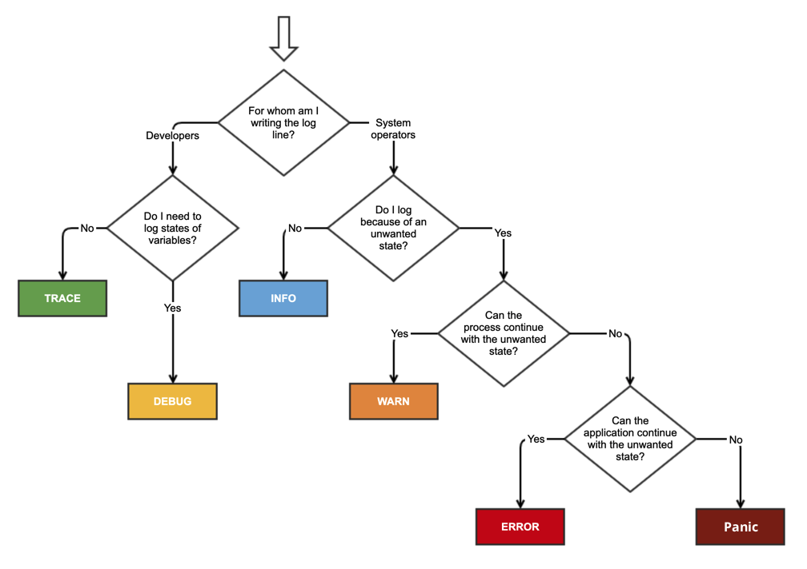

# err_trail

Convience methods on `Result` and `Option` for logging when an `Err` or `None` is ecountered. Similar to [eros](https://github.com/mcmah309/eros) and [anyhow](https://github.com/dtolnay/anyhow)
but for logging.

## Feature Flags

**tracing** / **log** / **defmt** :
Enables support for the `tracing` or `log` or `defmt` crates. `error`, `warn`, `info`, `debug`, and `trace` methods are added to `Result` and are executed when the `Result` is an `Err` for logging purposes. They work similarly to `eros`'s and `anyhow`'s `.context(..)` method. e.g.
```rust
use err_trail::{ErrContext, ErrContextDisplay};


fn main() {
    let result: Result<(), &str> = Err("operation failed");

    let value: Result<(), &str> = result.error("If `Err`, this message is logged as error via tracing/log/defmt");
    let value: Result<(), &str> = result.warn("If `Err`, this message is logged as warn via tracing/log/defmt");
    let value: Result<(), &str> = result.with_error(|err| format!("If `Err`, this message is logged as error via tracing/log/defmt: {}", err));
    let value: Option<()> = result.consume_error(); // If `Err`, the `Err` is logged as error via tracing/log/defmt
    let value: Option<()> = result.consume_with_warn(|err| format!("If `Err`, this message is logged as warn via tracing/log/defmt: {}", err));
    // ...etc.
}
```
This is useful tracing context around errors. e.g.
```rust,ignore
fn main() {
    let val = func().warn("`func` failed, here is some extra context like variable values")?;
    // or
    let val = func().consume_warn();
}
```
rather than
```rust,ignore
fn main() {
    let val = func().inspect_err(|err| tracing::warn!("`func` failed, here is some extra context like variable values"))?;
    // or
    let val = func().inspect_err(|err| tracing::warn!("{}", err)).ok();
}
```
## Notes For Libraries

This api is perfect for libraries. Downstream binaries ultimately decide the implementation for which logging provider to use, if any. If no implementations is selected, since all the above methods are inlined, the code becomes a no-op and will be optimized away during compilation.

## Guide



- If returning a `Result` to the calling function, context should usually be `warn`.
- If consuming a `Result`, context should usually be `error`.

## no_std

This crate supports `#![no_std]`.